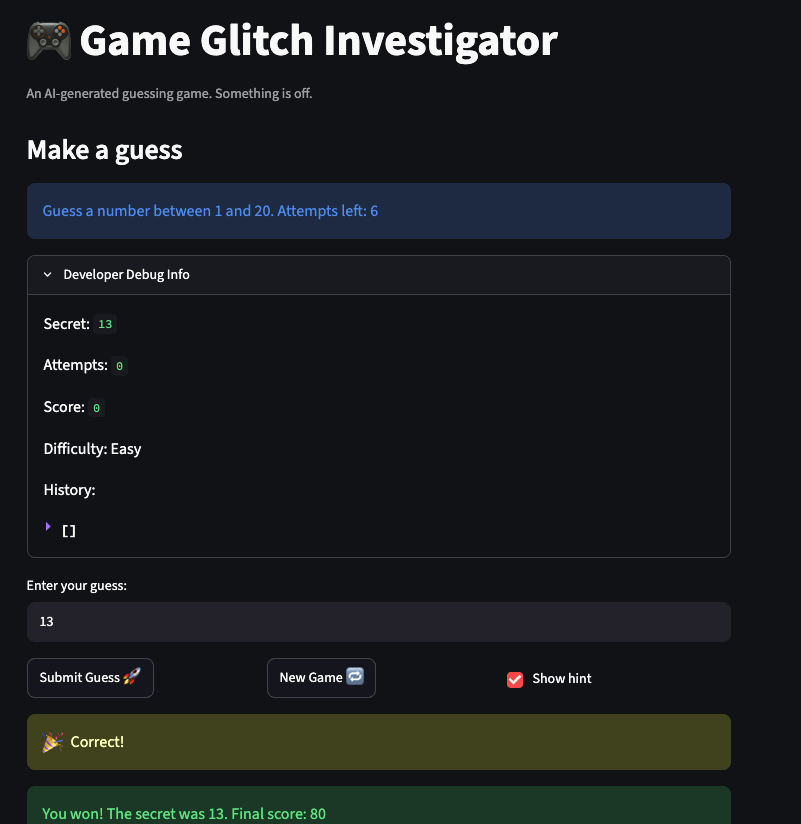

# 🎮 Game Glitch Investigator: The Impossible Guesser

## 🚨 The Situation

You asked an AI to build a simple "Number Guessing Game" using Streamlit.
It wrote the code, ran away, and now the game is unplayable. 

- You can't win.
- The hints lie to you.
- The secret number seems to have commitment issues.

## 🛠️ Setup

1. Install dependencies: `pip install -r requirements.txt`
2. Run the broken app: `python -m streamlit run app.py`

## 🕵️‍♂️ Your Mission

1. **Play the game.** Open the "Developer Debug Info" tab in the app to see the secret number. Try to win.
2. **Find the State Bug.** Why does the secret number change every time you click "Submit"? Ask ChatGPT: *"How do I keep a variable from resetting in Streamlit when I click a button?"*
3. **Fix the Logic.** The hints ("Higher/Lower") are wrong. Fix them.
4. **Refactor & Test.** - Move the logic into `logic_utils.py`.
   - Run `pytest` in your terminal.
   - Keep fixing until all tests pass!

## 📝 Document Your Experience

- [ ] Describe the game's purpose.
  - [ ] This is basically a number guessing game (like binary search).
- [ ] Detail which bugs you found.
  - [ ] The ranges for the difficulties was wrong.
- [ ] Explain what fixes you applied.
  - [ ] The ranges for the difficulties was fixed (easy is 1-20, normal is 1-50, hard is 1-100).

## 📸 Demo Walkthrough

Describe your fixed game in numbered steps so a reader can follow along without watching a video:

1. User opens page
2. User choses difficulty (easy)
3. Game says "Guess a number between 1 and 20
4. Answer is 13
5. User guesses 15
6. Game says "go lower"
7. User guesses 13
8. Game says "Correct!"

**Screenshot** *(optional)*: 

## 🧪 Test Results

```
# Paste your pytest output here, e.g.:
# pytest tests/
# ========================= X passed in 0.XXs =========================


test/test_game_logic.py::test_range_matches_difficulty[Easy-expected0] PASSED                                                                                                  [ 16%]
test/test_game_logic.py::test_range_matches_difficulty[Normal-expected1] PASSED                                                                                                [ 33%]
test/test_game_logic.py::test_range_matches_difficulty[Hard-expected2] PASSED                                                                                                  [ 50%]
test/test_game_logic.py::test_normal_and_hard_not_swapped PASSED                                                                                                               [ 66%]
test/test_game_logic.py::test_upper_bounds_increase_with_difficulty PASSED                                                                                                     [ 83%]
test/test_game_logic.py::test_all_ranges_start_at_one PASSED  
```

## 🚀 Stretch Features

- [ ] [If you choose to complete Challenge 4, describe the Enhanced UI changes here — a screenshot is optional]
